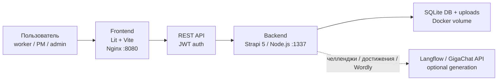
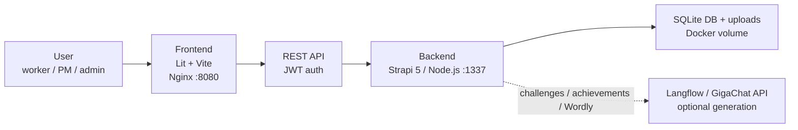

# Sber-Landing / Фабрика решений

> Платформа геймификации сотрудников: челленджи, XP, достижения, рейтинг, магазин наград, Wordly и AI-генерация контента.

[](#технологии)
[](#технологии)
[](#архитектура)
[](#быстрый-запуск)

## RU

**Sber-Landing** начался как лендинг системы геймификации, но вырос в рабочий прототип платформы **"Фабрика решений"**. Внутри есть публичный вход, кабинет сотрудника и проектного менеджера, админ-панель, челленджи, ежедневные активности, достижения, рейтинг, магазин наград, мини-игра Wordly и optional AI через Langflow / GigaChat.

Главная идея: сотрудник выполняет рабочие активности, получает XP, растит уровень, видит прогресс, участвует в рейтинге и обменивает XP на награды.

## Что умеет проект

- **Авторизация и роли**: `worker`, `project_manager`, `admin`.
- **Кабинет сотрудника**: профиль, команды, доступные челленджи, мои челленджи, достижения, рейтинг, магазин, Wordly и F&Q.
- **PM-сценарии**: очередь проверок, подтверждение или отклонение выполнений, командный контекст.
- **Админка**: пользователи, команды, челленджи, достижения, магазин, Wordly, AI-генерация и переход в Strapi admin.
- **Геймификация**: XP, уровни, достижения, рейтинг, награды и заявки на обмен XP.
- **Wordly**: ежедневная мини-игра со словом дня, 5 попытками и наградой 50 XP за победу.
- **AI / Langflow**: генерация черновиков челленджей, достижений и слов для Wordly.

## Игровая логика

| Уровень | Смысл | XP |
|---|---|---:|
| `Light` | Простые рабочие действия и быстрые активности | 50 |
| `Medium` | Командные или продуктовые задачи средней сложности | 100 |
| `Hard` | Инициативы с заметным влиянием на процесс или продукт | 150 |

| Условие | Награда |
|---|---|
| `Light` | Стикерпак |
| `Light + Medium` | Брелок |
| `Light + Medium + Hard` | Встреча с экспертом |

## Архитектура



Frontend собирается через Vite и в Docker отдается Nginx. Backend работает на Strapi 5, хранит данные в SQLite и предоставляет REST API. AI-интеграция вынесена на backend: секретные ключи не должны попадать во frontend.

## Технологии

| Слой | Стек |
|---|---|
| Frontend | Lit, Vite, Tailwind CSS, GSAP |
| Backend | Strapi 5, Node.js, TypeScript |
| Auth | Strapi users-permissions, JWT |
| Database | SQLite через `better-sqlite3` |
| Infra | Docker, Docker Compose, Nginx |
| AI | Langflow / GigaChat-compatible endpoints |

## Быстрый запуск

### 1. Подготовить переменные окружения

Создайте `.env` рядом с `docker-compose.yml`:

```env
APP_KEYS=change-me-1,change-me-2
API_TOKEN_SALT=change-me
ADMIN_JWT_SECRET=change-me
TRANSFER_TOKEN_SALT=change-me
JWT_SECRET=change-me
ENCRYPTION_KEY=change-me

# optional AI generation
LANGFLOW_API_KEY=
LANGFLOW_CHALLENGE_ENDPOINT=
LANGFLOW_ACHIEVEMENT_ENDPOINT=
LANGFLOW_WORDY_ENDPOINT=
```

Для реального запуска замените `change-me` на собственные секреты. Не храните production-секреты в репозитории.

### 2. Запустить проект

```bash
docker compose up --build
```

После запуска:

- frontend: <http://localhost:8080>
- backend API: <http://localhost:1337>
- Strapi admin: <http://localhost:1337/admin>

При первом открытии Strapi admin нужно создать администратора Strapi.

## Локальная разработка без Docker

Backend:

```bash
cd backend
npm install
cp .env.example .env
npm run dev
```

Frontend:

```bash
cd frontend
npm install
cp .env.example .env
npm run dev
```

По умолчанию frontend ожидает API по адресу `http://localhost:1337`.

## Основные маршруты

| Route | Назначение |
|---|---|
| `/` | Вход в систему |
| `/employee` | Кабинет сотрудника и PM |
| `/admin` | Админ-панель приложения |
| `:1337/admin` | Техническая Strapi admin |

## Структура проекта

```text
.
├── frontend/              # Lit + Vite frontend
│   ├── src/components/    # login, employee, admin pages
│   └── nginx.conf         # SPA fallback for production build
├── backend/               # Strapi 5 backend
│   ├── src/api/           # custom API domains
│   ├── src/services/      # gamification logic
│   └── config/            # Strapi config
├── docker-compose.yml     # frontend + backend services
├── Dockerfile             # multi-target Docker build
├── project.md             # original PRD / task context
└── PROJECT_SUMMARY.md     # product and technical decisions
```

## Полезные команды

```bash
# Build frontend
cd frontend && npm run build

# Build backend
cd backend && npm run build

# Run only backend in Docker
docker compose up --build backend

# Run only frontend in Docker
docker compose up --build frontend
```

## Важные замечания

- Langflow / GigaChat не обязателен: основные кабинеты, челленджи, магазин, Wordly и достижения работают без AI.
- `LANGFLOW_API_KEY` должен храниться только на backend.
- Wordly обновляет игровой период в 09:00 по Москве.
- PM не является отдельным приложением: это расширенный режим кабинета сотрудника.
- Админка приложения и Strapi admin решают разные задачи: первая для продукта, вторая для технического управления CMS.

---

## EN

**Sber-Landing** started as a gamification landing page and evolved into a working prototype of the **"Factory of Solutions"** employee engagement platform. It includes login, employee and project manager dashboards, an admin panel, challenges, daily activities, achievements, leaderboard, reward shop, Wordly mini-game, and optional AI content generation through Langflow / GigaChat-compatible endpoints.

The core idea is simple: employees complete work-related activities, earn XP, level up, track progress, compete in a leaderboard, and exchange XP for rewards.

## Features

- **Authentication and roles**: `worker`, `project_manager`, `admin`.
- **Employee dashboard**: profile, teams, available challenges, own challenges, achievements, leaderboard, shop, Wordly, and F&Q.
- **Project manager flow**: review queue, approve or reject submissions, team context.
- **Admin panel**: users, teams, challenges, achievements, shop, Wordly, AI generation, and Strapi admin link.
- **Gamification**: XP, levels, achievements, leaderboard, rewards, and XP exchange requests.
- **Wordly**: daily word game with 5 attempts and 50 XP for a win.
- **AI / Langflow**: draft generation for challenges, achievements, and Wordly words.

## Game Rules

| Difficulty | Meaning | XP |
|---|---|---:|
| `Light` | Simple work actions and quick activities | 50 |
| `Medium` | Team or product tasks with medium effort | 100 |
| `Hard` | Initiatives with visible product or process impact | 150 |

| Condition | Reward |
|---|---|
| `Light` | Sticker pack |
| `Light + Medium` | Keychain |
| `Light + Medium + Hard` | Expert meeting |

## Architecture



The frontend is built with Vite and served by Nginx in Docker. The backend runs on Strapi 5, stores data in SQLite, and exposes REST APIs. AI integration lives on the backend side, so secret keys do not need to be exposed to the frontend.

## Tech Stack

| Layer | Stack |
|---|---|
| Frontend | Lit, Vite, Tailwind CSS, GSAP |
| Backend | Strapi 5, Node.js, TypeScript |
| Auth | Strapi users-permissions, JWT |
| Database | SQLite via `better-sqlite3` |
| Infra | Docker, Docker Compose, Nginx |
| AI | Langflow / GigaChat-compatible endpoints |

## Quick Start

Create `.env` next to `docker-compose.yml`:

```env
APP_KEYS=change-me-1,change-me-2
API_TOKEN_SALT=change-me
ADMIN_JWT_SECRET=change-me
TRANSFER_TOKEN_SALT=change-me
JWT_SECRET=change-me
ENCRYPTION_KEY=change-me

# optional AI generation
LANGFLOW_API_KEY=
LANGFLOW_CHALLENGE_ENDPOINT=
LANGFLOW_ACHIEVEMENT_ENDPOINT=
LANGFLOW_WORDY_ENDPOINT=
```

Run:

```bash
docker compose up --build
```

Open:

- frontend: <http://localhost:8080>
- backend API: <http://localhost:1337>
- Strapi admin: <http://localhost:1337/admin>

## Local Development

Backend:

```bash
cd backend
npm install
cp .env.example .env
npm run dev
```

Frontend:

```bash
cd frontend
npm install
cp .env.example .env
npm run dev
```

By default, the frontend expects the API at `http://localhost:1337`.

## Notes

- Langflow / GigaChat is optional. Core dashboards, challenges, shop, Wordly, and achievements work without AI.
- Keep `LANGFLOW_API_KEY` on the backend only.
- Wordly resets daily at 09:00 Moscow time.
- PM is not a separate app; it is an extended employee dashboard mode.
- The product admin panel and Strapi admin are separate tools with different responsibilities.
